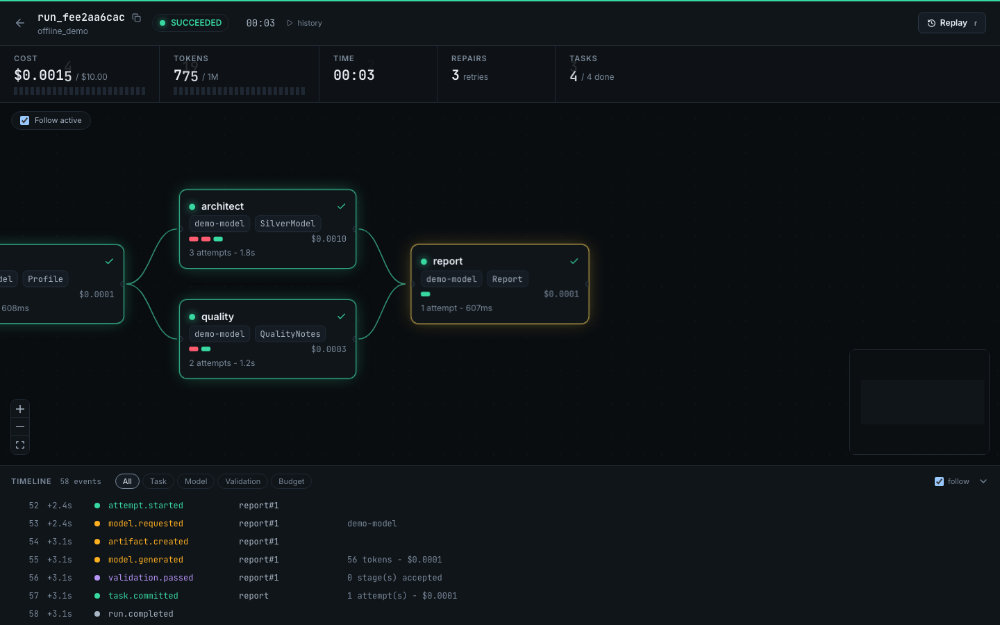
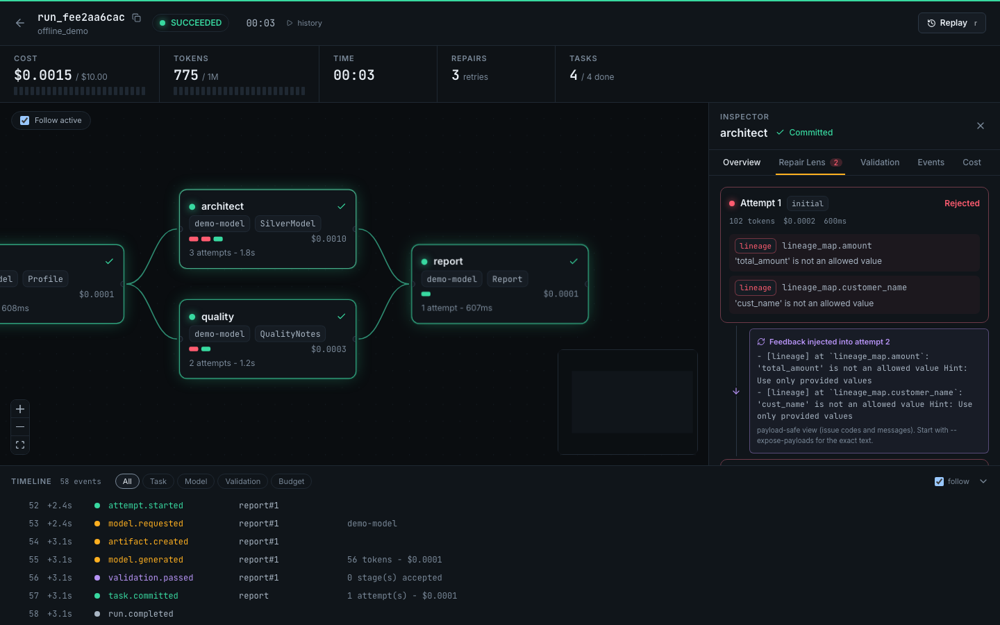

# Runway

**Probabilistic agents propose. Deterministic runtime commits.**

Runway is an open (MIT) agentic + deterministic framework. Agents produce typed
artifacts; deterministic validators decide whether work is accepted; the runtime
checkpoints, budgets, and replays everything. Build your own validators, model
adapters, tool providers, event sinks, and flight plans on top.

Part of the **10x Factor Community Initiative**.

## Quickstart (offline, no API key)

```bash
pip install "runway-ai[ui]"
runway demo          # runs the offline repair-then-pass demo
runway dev           # opens the Runway Console
```





## Your first flow

```python
from pydantic import BaseModel
from runway.api import Flow, agent
from runway.core.budget import Limits
from runway.core.graph import WorkGraph
from runway.validators import min_items


class Topic(BaseModel):
    subject: str


class Notes(BaseModel):
    notes: list[str]


@agent(model="gpt-4o-mini", validators=[min_items("notes", 3)], budget=Limits(max_retries=2, max_cost_usd=0.10))
def research(t: Topic) -> Notes:
    """List key facts about the subject."""


def flow() -> Flow:
    g = WorkGraph("research", input_model=Topic)
    g.add(research)
    return Flow(g, Topic(subject="Delta Lake"))
```

`runway run my_flow:flow`, then `runway dev` to watch rejections, repairs, and commits live, or to replay from any node.

## Extend it

Validators, event sinks, and hooks are plugins discovered from entry points. Scaffold one with a conformance test:

```bash
runway new validator my-check   # also: sink, hook
cd my-check && pip install -e . && pytest && runway ext list
```

Installed sinks and hooks receive every run's events automatically. All plugin groups: `runway ext list`. See `CONTRIBUTING.md`, `GOVERNANCE.md`.

## Concepts

- **Artifact**: immutable, content-addressed Pydantic output.
- **Agent**: stateless LLM worker (via LiteLLM).
- **Task**: Agent + input/output contracts + validators + budget.
- **WorkGraph**: DAG of tasks with typed field bindings.
- **Validator**: deterministic gate returning structured feedback.
- **Checkpoint / Run**: every node boundary is an event; replay from any node.

See `docs/` and `SPEC.md`. License: MIT.
